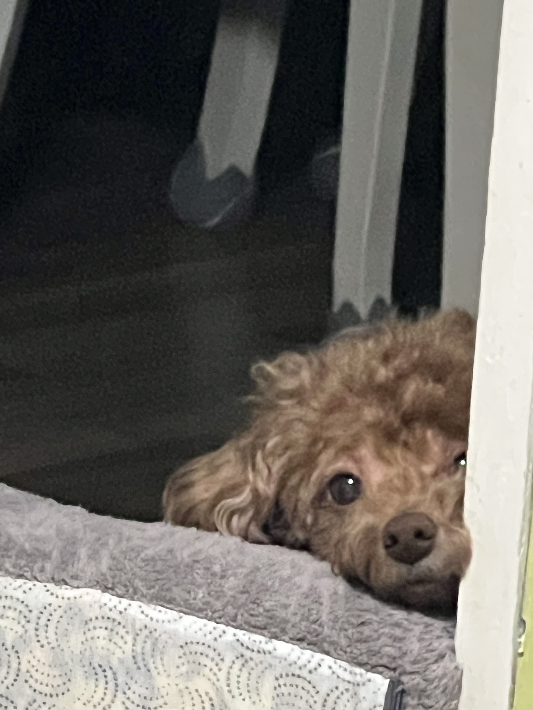

<table>
  <tr>
    <td width="200" align="center" valign="middle">
      
       
      <b>🐾 CTO Maru</b>
    </td>
    <td valign="top">
      <h3>👋 Coding with Maru & JJonyeok</h3>
      

        🦋 <b>SK Networks Family AI Camp</b> (2026.01 ~ ) 
        🎓 <b>나사렛대학교 인공지능학부</b> 졸업 예정 
        🔭 <b>Main Project:</b> <a href="https://github.com/JJonyeok2/Atheleo">Atheleo</a> (AI 체형 분석 앱)
      

      

        
        
        
        
      

      
📫 <code>jacob122@naver.com</code>

    </td>
  </tr>
</table>

  

