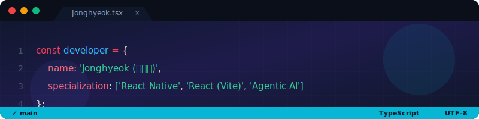

  <!-- Dynamic IDE-style Header Banner -->
  

<h1 align="center">Hey there! I'm Jonghyeok (전종혁) 👋</h1>

  <!-- Dynamic Typing Animation Effect -->
  

  <a href="#-about-me">About Me</a> •
  <a href="#-tech-stack--tooling">Tech Stack</a> •
  <a href="#-git-metrics">Git Metrics</a> •
  <a href="#-featured-projects">Featured Projects</a> •
  <a href="#-get-in-touch">Contact</a>

---

### 💫 About Me

*   📱 I specialize in building **high-performance cross-platform mobile apps** (React Native) and **responsive web interfaces** (React / Next.js).
*   🤖 Experienced in building and serving AI models, constructing real-time inference backends with **FastAPI** and **Django**.
*   🎨 Passionate about crafting premium user interfaces and resolving complex build/architecture challenges (e.g., React Native Fabric Architecture).
*   🚀 Collaborative team leader who bridges the gap between client interfaces and intelligent backends.

---

### 🛠️ Tech Stack & Tooling

<table width="100%">
  <tr>
    <td align="center" width="20%"><strong>Languages</strong></td>
    <td>
      
      
      
      
      
    </td>
  </tr>
  <tr>
    <td align="center"><strong>Frontend &amp; Mobile</strong></td>
    <td>
      
      
      
      
    </td>
  </tr>
  <tr>
    <td align="center"><strong>Backend &amp; AI</strong></td>
    <td>
      <img src="https://img.shields.io/badge/FastAPI-009688?style=
